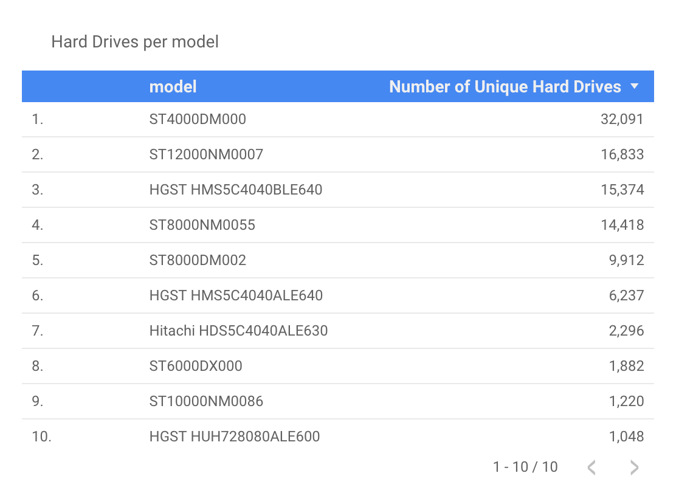
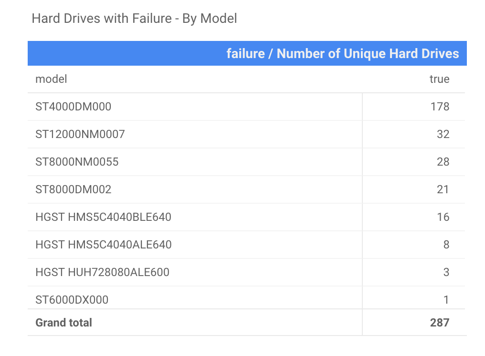
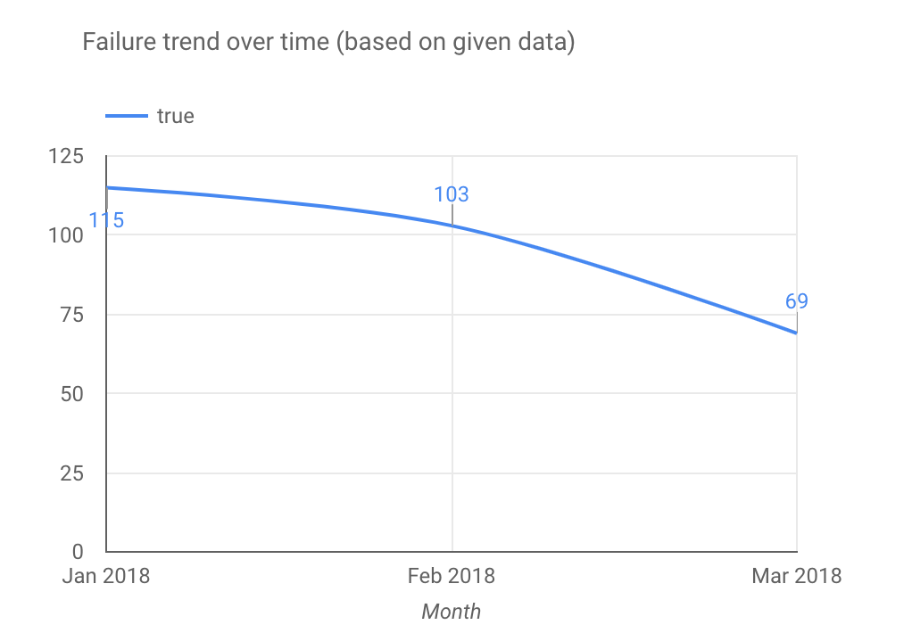

# Machine Learning to Predicting Harddrive Failures 
Using Backblaze dataset on Kaggle.

### About the project: 
This was a Data Science Case Study done for Juul Labs in collaboration with McKinsey & Company. A similar dataset and project can also be found on Kaggle.com

### Sample Dataset: 
A sample of SMART hard drives dataset can be found and downloaded at: https://www.kaggle.com/backblaze/hard-drive-test-data

### What are SMART systems ?
SMART features or *S.M.A.R.T. (Self-Monitoring, Analysis and Reporting Technology)* is a software monitoring system for hard drives. SMART generates a collection different metrics related to help evaluate the overall health of a Hard Drive. 

A single metrics may not always determine the exact failure prediction but are commonly accepted to help identify any imminent failure and help handle the backup and restore, in time. 

### About this case study :
This case study relies on a given data stream provided for this purpose. The goal of this case study is to try and analyze given data and find out meaningful information that can help determine drives failure trends and different factors that may idicate if a drive would fail, and attempt to propose a more data driven answer to future failures based on SMART metrics.

The study concludes with discussing possible opportunities and challenges with existing model and features that can help design a better predictive model for future. 

--------

Here's a quick overview of how this problem has been approached: 

#### Extraction and Load
1. Connect to the postgres server.
2. Download the dataset offline

#### Transform
3. Wrangle and explore
4. Change Dimentions, clean and slice and dice

#### Analyze
5. Analyze dataset, plot most significant trends

#### Predict:
6. Feature Selection
7. Model and predict

#### Conclusion and Improvement Ideas:
8. Conclusion
9. Challenges with the current dataset and ways to improve it

#### Tech stack:
`python, sql, pandas, scikit and other machine learning libaries, postgres`

#### Sample report overview: 
(This is Optional)

<table>
<tr>
<td> 1. Number Hard Drives per model
 </td>
    <td>2. Number of positive failures by model
         </td></tr></table>
        
        
<table>
    <tr>
        <td>3. Failure Trend over time
            </td>
<td>4. Daily Failure Trend to determine missing failure data pattern
    </td></tr></table>

and more...

#### About the author:
[@geekidharsh](https://github.com/geekidharsh) : I am Data Engineer with [Merck KGaA](https://www.merckgroup.com/en) with 4+ years of experience in E-commerce, Digital Marketing and understanding quickly changing user behavior, at scale.
